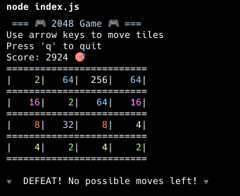

# 2048 Game (CLI Version)



## English

### Description
This is a simple CLI-based implementation of the popular game **2048**, built with Node.js. The game is played in the terminal using arrow keys to move the tiles.

### Features
- Playable in the terminal
- Colorful display using `chalk`
- Classic 2048 mechanics
- Score tracking

### Installation
Ensure you have [Node.js](https://nodejs.org/) installed. Then, install the required dependencies:

```sh
npm install
```

### Usage
Run the game using:

```sh
node index.js
```

### Controls
- Use **Arrow keys** to move tiles
- Press **'q'** to quit the game

### Winning and Losing
- Win by reaching **2048**
- Lose when no more moves are possible

---

## Українська

### Опис
Це проста версія популярної гри **2048** для командного рядка, створена на Node.js. Грайте прямо в терміналі, використовуючи клавіші-стрілки для переміщення плиток.

### Особливості
- Гра в терміналі
- Кольорове оформлення за допомогою `chalk`
- Класична механіка 2048
- Підрахунок очок

### Встановлення
Переконайтеся, що у вас встановлено [Node.js](https://nodejs.org/). Потім встановіть необхідні залежності:

```sh
npm install
```

### Використання
Запустіть гру командою:

```sh
node index.js
```

### Управління
- **Стрілки** – переміщення плиток
- **'q'** – вийти з гри

### Перемога та поразка
- Перемога – досягнення плитки **2048**
- Поразка – відсутність можливих ходів

